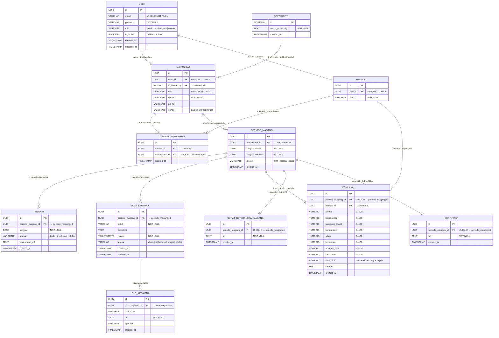

# ERD - Sistem Manajemen Magang

> Dihasilkan dari 8 file migration Flyway di `src/main/resources/db/migration`

## Entity Relationship Diagram

---

## Ringkasan Tabel Final (setelah semua migration)

| No | Tabel | PK Type | Keterangan |
|----|-------|---------|------------|
| 1 | `user` | UUID | Akun login; role: admin/mahasiswa/mentor |
| 2 | `university` | BIGSERIAL | Master data universitas (V6) |
| 3 | `mahasiswa` | UUID | Profil mahasiswa; FK ke user & university |
| 4 | `mentor` | UUID | Profil mentor; FK ke user |
| 5 | `mentor_mahasiswa` | UUID | Mapping 1 mentor → banyak mahasiswa |
| 6 | `periode_magang` | UUID | Periode magang mahasiswa |
| 7 | `absensi` | UUID | Absensi harian per periode *(V8: waktu_masuk/keluar/status_verifikasi dihapus)* |
| 8 | `data_kegiatan` | UUID | Log kegiatan magang; + kolom status (V4) |
| 9 | `file_kegiatan` | UUID | File lampiran kegiatan |
| 10 | `penilaian` | UUID | Penilaian 8 aspek oleh mentor; nilai_total GENERATED |
| 11 | `surat_keterangan_magang` | UUID | SKM 1-to-1 dengan periode |
| 12 | `sertifikat` | UUID | Sertifikat 1-to-1 dengan periode |

---

## Perubahan per Migration

| Migration | Perubahan |
|-----------|-----------|
| V1 | Buat semua tabel dasar (12 tabel + index) |
| V2 | Tambah kolom `gender` & `universitas` ke `mahasiswa` |
| V3 | Tambah kolom `status_verifikasi` ke `absensi` |
| V4 | Tambah kolom `status` ke `data_kegiatan` |
| V5 | Insert seed data |
| V6 | Buat tabel `university`; ganti kolom `universitas` (text) → `id_university` (FK) |
| V7 | Fix seed data university |
| V8 | Drop kolom `waktu_masuk`, `waktu_keluar`, `status_verifikasi` dari `absensi` |
